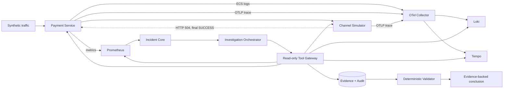

# PaySRE Lab

PaySRE Lab 是一个面向支付故障调查的开源 AI SRE 实验场。它不是“让模型搜索日志”的聊天机器人，而是一套可运行的合成支付系统、故障注入器和证据约束型调查控制面。

当前纵向切片复现一个支付领域中高风险、又非常典型的问题：**渠道已经成功，但同步响应超时丢失，支付系统把交易标记为 UNKNOWN**。控制面会从 Prometheus 指标下钻到代表交易的 Loki 日志，通过日志中的真实 TraceId 获取 Tempo 调用链，再结合支付时间线、渠道终态和确定性影响面，输出必须引用真实 Evidence 的结构化结论。

> 所有数据均为合成数据；系统不处理卡号、账户凭证或真实资金操作。当前版本只开放调查类只读工具。

## 为什么这个项目值得做

- **支付业务不是背景板**：包含支付状态机、UNKNOWN 中间态、渠道最终态、幂等受理、金额与币种约束以及可审计的状态时间线。
- **Agent 不能自由发挥**：每项结论都必须引用当前 Incident 的 Evidence，影响金额必须与确定性工具结果一致。
- **指标、日志、Trace 是证据而非上下文装饰**：Agent 只能使用枚举化、只读、有范围上限的查询工具；不能提交原始查询语言或任意 URL。
- **SRE 自身也有保护边界**：工具在有界线程池执行，具备超时、64 KiB 结果上限、SHA-256 内容哈希和全量调用审计。
- **失败时安全降级**：12 次工具调用上限、120 秒总截止时间、连续三次无新证据和两次结论校验失败都会转 `NEEDS_HUMAN`。
- **可以重复评测**：故障场景带固定随机种子和 Ground Truth，评分覆盖根因、证据召回率、Runbook 与人工审批策略。

## 当前架构



三个可运行应用：

- `channel-simulator`：确定性故障注入，并保存渠道最终状态。
- `payment-service`：支付受理、幂等、状态机、业务指标与 Trace 语义。
- `sre-control-plane`：告警聚合、Incident、可观测只读工具、Evidence、审计、调查编排与评分输入。

技术基线为 Java 21、Spring Boot 4.1、Spring AI 2.0 BOM、PostgreSQL 17、Prometheus 3.12、Loki 3.7、Tempo 2.10、OpenTelemetry Collector 0.156 和 Grafana 13.1。调查模型可切换：默认的确定性 Stub Model 让 CI 与回归评测完全可复现；设置 `INVESTIGATION_MODEL=minimax` 后由 MiniMax（OpenAI 兼容 API）驱动真实调查，见下文「接入真实模型（MiniMax）」。

## 快速验证

前置条件：JDK 21、Maven 3.9+。完整端到端测试还需要可用的 Docker Engine。

```bash
mvn clean verify
```

该命令会执行单元测试、Spring 上下文测试、H2/PostgreSQL 迁移测试、场景评分和部署配置测试。CI 还会启动完整 Compose 栈，独立运行可观测证据纵向切片。

启动本地演示环境：

```bash
docker compose -f deploy/compose.yaml up -d --build --wait
```

服务端口：

| 服务 | 地址 |
|---|---|
| Payment Service | `http://localhost:8080` |
| Channel Simulator | `http://localhost:8081` |
| SRE Control Plane | `http://localhost:8082` |
| Grafana | `http://localhost:3000` |
| Prometheus | `http://localhost:9090` |
| Loki | `http://localhost:3100` |
| Tempo | `http://localhost:3200` |

每个服务都提供 `/actuator/health/readiness`。停止并清理环境：

```bash
docker compose -f deploy/compose.yaml down -v --remove-orphans
```

## 故障目录与可重复场景

故障目录位于 [`fault-scenarios/`](fault-scenarios/)，每个 YAML 自带固定随机种子、流量和 Ground Truth（含调查期望与处置期望），由 `FaultScenarioE2ETest` 参数化回放。

| 场景 | 渠道故障 | 渠道终态 | 最终支付状态 | 类型 | Ground Truth |
|---|---|---|---|---|---|
| `channel-timeout-but-success-v1` | `TIMEOUT_BUT_SUCCESS` | `SUCCESS` | `SUCCESS` | 受控处置 | [YAML](fault-scenarios/channel-timeout-but-success-v1.yaml) |
| `channel-timeout-but-failed-v1` | `TIMEOUT_BUT_FAILED` | `FAILED` | `FAILED` | 受控处置 | [YAML](fault-scenarios/channel-timeout-but-failed-v1.yaml) |
| `channel-decline-spike-v1` | `DECLINE_ALL` | `FAILED` | n/a | advisory（仅观察） | [YAML](fault-scenarios/channel-decline-spike-v1.yaml) |
| `channel-code-mapping-error-v1` | `NONE`（配置侧） | n/a | n/a | advisory（仅观察） | [YAML](fault-scenarios/channel-code-mapping-error-v1.yaml) |

两个场景共享同一条调查-处置-关单链路：

1. 对 `CHANNEL_A` 安装概率为 100% 的渠道故障规则（同根因：响应丢失）。
2. 创建 5 笔 CNY 10.00 的合成支付，本地状态全部进入 `UNKNOWN`，渠道最终态由故障类型决定（SUCCESS 或 FAILED）。
3. Alertmanager Webhook 创建并聚合 Incident。
4. 等待 Prometheus、Loki、Tempo 摄入，再创建并调查 Incident。
5. 调查器按固定顺序查询 UNKNOWN 指标、状态日志、分布式 Trace、支付时间线、渠道终态和影响面。
6. 结论必须识别 `CHANNEL_TIMEOUT_RESPONSE_LOST`，引用六类 Evidence，并建议 `query-and-sync-unknown-payments`（两个场景结论相同，落地终态由渠道决定）。
7. 处置走四眼审批：`sre-primary` 提案 → `sre-secondary` 审批 → Runbook 执行并审计。`ScenarioEvaluator` 对根因、证据召回、推荐 Runbook、人工复核策略与处置结果统一评分（终态验收：SUCCESS 场景收敛到 `SUCCESS`、FAILED 场景收敛到 `FAILED`）。
8. 通过评分后 `POST /api/incidents/{id}/resolution` 关单，把 Incident 推进到 `RESOLVED`，下一个场景复用同一条渠道不会与上一个 Incident 聚合。

advisory 类场景（如 `channel-decline-spike-v1`）只走到调查评分——结论的 `recommendedRunbook` 为空，`ActionGuard` 以 `ADVISORY_NO_RUNBOOK` 拒绝任何 Runbook 提案，Incident 在调查后直接 `MITIGATED`、由人直接关单。

只运行评分与部署结构测试：

```bash
mvn -pl e2e-tests -am test \
  -Dtest=ScenarioEvaluatorTest,DeploymentConfigurationTest \
  -Dsurefire.failIfNoSpecifiedTests=false
```

只运行完整可观测纵向切片（需要先启动上面的 Compose 栈）：

```bash
PAY_SRE_COMPOSE_E2E=true mvn -B -ntp -pl e2e-tests -am \
  -Dtest=FaultScenarioE2ETest \
  -Dsurefire.failIfNoSpecifiedTests=false test
```

测试会在 90 秒上限内轮询摄入状态，对每个场景验证：UNKNOWN Gauge 不含交易 ID Label、状态日志携带 `CHANNEL_TIMEOUT` 和 TraceId、同一 Trace 含支付/渠道 Span、六类 Evidence 哈希可重算、每次工具调用都有审计记录，并断言处置终态与场景 Ground Truth 完全一致、Incident 关单成功。

## 接入真实模型（MiniMax）

默认调查由确定性 Stub Model 驱动。要让 MiniMax 真实模型接管决策：

1. 在 [platform.minimax.io](https://platform.minimax.io)（国际站）或 [platform.minimaxi.com](https://platform.minimaxi.com)（国内站）创建 API key。
2. 复制 `deploy/env.example` 为 `deploy/.env`，填入 `MINIMAX_API_KEY`，并设置：

```bash
INVESTIGATION_MODEL=minimax
MINIMAX_API_KEY=<你的真实 key>          # 仓库中永远只保留占位符
MINIMAX_BASE_URL=https://api.minimax.io/v1   # 国内站改为 https://api.minimaxi.com/v1
MINIMAX_MODEL=MiniMax-M2                # 可选 MiniMax-M2.1 / M2.5 / M2.7 / M3
INVESTIGATION_MODEL_TIMEOUT=PT60S       # 真实模型需要比 stub 更长的单步预算
```

3. `docker compose -f deploy/compose.yaml --env-file deploy/.env up -d --build --wait`，之后照常运行故障场景。

模型只能通过 OpenAI 兼容的 function calling 在 8 个工具里做选择：6 个只读网关工具，加 `conclude_investigation` 与 `escalate_to_human` 两个决策工具。每一步决策都是无状态单发请求——完整调查状态（Incident、种子交易、已采集 Evidence、历史工具结果、上一次结论校验失败原因）每轮重建注入。所有既有安全边界原样生效：工具审计、Evidence 哈希、结论验证器、12 次调用/120 秒/连续空结果的 fail-closed 熔断。模型返回自由文本、未知根因、非法金额或网络故障时一律转 `NEEDS_HUMAN`，绝不猜测。设计细节见 [`docs/superpowers/specs/2026-07-17-minimax-investigation-model-design.md`](docs/superpowers/specs/2026-07-17-minimax-investigation-model-design.md)。

缺 key 启动 `minimax` 模式会直接拒绝启动；CI 与 `mvn clean verify` 不需要任何外部凭据。

## 配置中心（Nacos）

三个应用支持从 Nacos 拉取覆盖配置（Spring Cloud Alibaba `2025.1.0.0`，`spring.config.import` 模式，无 bootstrap）。默认关闭，激活 `nacos` profile 后启用；**Nacos 连接信息只能放在 `deploy/.env`（已被 gitignore）或 shell 环境变量里，仓库中只有 `${NACOS_*}` 占位符**——`NacosConfigurationTest` 会在 `mvn verify` 时拒绝任何写死的地址或凭据。

```bash
# deploy/.env（gitignored，示例见 deploy/env.example）
SPRING_PROFILES_ACTIVE=nacos
NACOS_SERVER_ADDR=<host:8848>       # 拿到地址后填这里
NACOS_NAMESPACE=                    # 公共命名空间留空
NACOS_GROUP=pay-sre-lab
NACOS_USERNAME=<username>
NACOS_PASSWORD=<password>
```

在 Nacos 中按 group `pay-sre-lab` 创建三个 YAML dataId：`payment-service.yml`、`channel-simulator.yml`、`sre-control-plane.yml`，内容即想要覆盖的 Spring 配置（典型用法：把 `paysre.investigation.minimax.api-key`、`paysre.investigation.model` 放进 `sre-control-plane.yml`，本地就不再需要 `MINIMAX_API_KEY` 环境变量）。远端配置优先级高于本地 `application.yml`。`nacos` profile 激活但未提供 `NACOS_SERVER_ADDR` 时启动直接失败（fail-fast），不会带病运行。

## 安全不变量

- 模型不能执行 Shell、SQL、SSH、Kubernetes 或任意 HTTP 请求。
- 基础阶段所有工具都是 `READ_ONLY`；未知工具直接拒绝并审计。
- Evidence 绑定 Incident、工具名称、工具版本、采集时间和 SHA-256。
- Evidence 内容递归按 JSON Key 规范化后再计算哈希；数组顺序保留业务语义。
- 模型不能自行计算或改写影响金额；结论必须匹配影响面 Evidence。
- 建议 Runbook 是允许列表中的确定名称，且当前场景强制人工复核。
- 写路径与调查模型完全隔离：Runbook 必须由人提案、由另一个人审批（four-eyes）才会执行，Action Guard 审计每一次尝试（含拒绝）。
- 控制面从不直接改写支付状态：`query-and-sync-unknown-payments` 只触发支付服务自行向渠道查询终态并走状态机收敛；处置范围锁定为结论引用的影响面 Evidence。
- Runbook 执行成功 → Incident `MITIGATED`；执行失败或超时 → `NEEDS_HUMAN`（fail-closed）。

## 主要 API

| 方法 | 路径 | 用途 |
|---|---|---|
| `PUT` | `/api/admin/faults/{channel}` | 安装合成渠道故障 |
| `POST` | `/api/payments` | 创建合成支付 |
| `GET` | `/api/payments/{id}/timeline` | 查询支付业务时间线 |
| `POST` | `/api/alerts/alertmanager` | 接收告警并创建/聚合 Incident |
| `POST` | `/api/incidents/{id}/investigations` | 启动有界调查 |
| `GET` | `/api/incidents/{id}/conclusion` | 查询结构化结论 |
| `GET` | `/api/incidents/{id}/evidence` | 查询脱敏后的 Evidence 元数据 |
| `GET` | `/api/incidents/{id}/evidence/{evidenceId}` | 查询 Incident-owned 规范 Evidence 内容 |
| `GET` | `/api/incidents/{id}/tool-audits` | 查询完整只读工具审计链 |
| `POST` | `/api/payments/{id}/state-sync` | 触发支付服务向渠道查询终态并收敛 UNKNOWN |
| `POST` | `/api/incidents/{id}/runbook-executions` | 提案执行允许列表内的 Runbook |
| `POST` | `/api/incidents/{id}/runbook-executions/{execId}/approval` | 第二人审批并受控执行（four-eyes） |
| `GET` | `/api/incidents/{id}/runbook-executions` | 查询 Runbook 执行单与结果 |

## 仓库导航

- [`docs/superpowers/specs/2026-07-16-pay-sre-lab-design.md`](docs/superpowers/specs/2026-07-16-pay-sre-lab-design.md)：完整产品与底层模块设计。
- [`docs/superpowers/plans/2026-07-16-pay-sre-lab-foundation.md`](docs/superpowers/plans/2026-07-16-pay-sre-lab-foundation.md)：第一阶段可执行实施计划。
- [`docs/superpowers/plans/2026-07-17-pay-sre-observability.md`](docs/superpowers/plans/2026-07-17-pay-sre-observability.md)：可观测证据平面实施与验收计划。
- [`docs/architecture/observability-evidence-plane.md`](docs/architecture/observability-evidence-plane.md)：指标、日志、Trace、工具、Evidence、审计和 fail-closed 调查的底层实现。
- `platform-contracts/`：跨进程稳定协议与金额模型。
- `payment-system/`：渠道仿真和支付服务。
- `sre-control-plane/`：Incident、Evidence、工具与调查编排。
- `fault-scenarios/`：可版本化 Ground Truth。
- `e2e-tests/`：评分器和容器化纵向切片。
- `observability/`：Prometheus、Loki、Tempo、Collector 和 Grafana 配置。
- `deploy/`：固定 UID 的非 root 镜像和本地完整 Compose。

## 后续方向

设计文档已经为以下能力保留边界：更多支付故障、Replay/Live Model、拓扑与历史事故知识、Action Guard、双人审批、确定性 Runbook、事故控制台和 PaySRE Benchmark。

第一阶段刻意不让 LLM 参与状态机、账务计算、权限判断或写操作。这个约束不是功能缺失，而是支付 AI SRE 能够进入真实工程环境的前提。

## 常见问题

- **Compose 一直等待健康检查**：运行 `docker compose -f deploy/compose.yaml ps --all`，再用 `docker compose -f deploy/compose.yaml logs <service>` 查看具体服务。CI 失败会自动上传完整 Compose 日志。
- **调查立即转人工且提示指标不可用**：至少等待一个 5 秒 Prometheus 抓取周期，并确认 `http://localhost:9090/api/v1/targets` 中三个应用为 `UP`。
- **日志存在但没有 TraceId**：确认 Collector 配置包含 `trace_parser`，并检查应用文件日志中的 ECS `traceId`/`spanId`。
- **本机没有 Docker**：仍可运行 `mvn clean verify`；完整证据链以 GitHub Actions 的 Java 21 + Docker 结果为权威验收。

## License

[Apache License 2.0](LICENSE)
