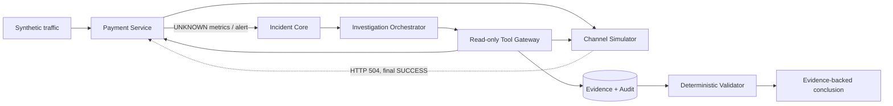

# PaySRE Lab

PaySRE Lab 是一个面向支付故障调查的开源 AI SRE 实验场。它不是“让模型搜索日志”的聊天机器人，而是一套可运行的合成支付系统、故障注入器和证据约束型调查控制面。

当前纵向切片复现一个支付领域中高风险、又非常典型的问题：**渠道已经成功，但同步响应超时丢失，支付系统把交易标记为 UNKNOWN**。控制面会聚合告警、重建支付时间线、查询渠道终态、计算受影响交易数与金额，并输出必须引用真实 Evidence 的结构化结论。

> 所有数据均为合成数据；系统不处理卡号、账户凭证或真实资金操作。当前版本只开放调查类只读工具。

## 为什么这个项目值得做

- **支付业务不是背景板**：包含支付状态机、UNKNOWN 中间态、渠道最终态、幂等受理、金额与币种约束以及可审计的状态时间线。
- **Agent 不能自由发挥**：每项结论都必须引用当前 Incident 的 Evidence，影响金额必须与确定性工具结果一致。
- **SRE 自身也有保护边界**：工具在有界线程池执行，具备超时、64 KiB 结果上限、SHA-256 内容哈希和全量调用审计。
- **失败时安全降级**：12 次工具调用上限、120 秒总截止时间、连续三次无新证据和两次结论校验失败都会转 `NEEDS_HUMAN`。
- **可以重复评测**：故障场景带固定随机种子和 Ground Truth，评分覆盖根因、证据召回率、Runbook 与人工审批策略。

## 当前架构



三个可运行应用：

- `channel-simulator`：确定性故障注入，并保存渠道最终状态。
- `payment-service`：支付受理、幂等、状态机、业务指标与 Trace 语义。
- `sre-control-plane`：告警聚合、Incident、工具网关、Evidence、调查编排与评分输入。

技术基线为 Java 21、Spring Boot 4.1、Spring AI 2.0 BOM、PostgreSQL 17、Testcontainers 2.0。当前调查使用确定性 Stub Model，从而让 CI 与回归评测完全可复现；真实模型适配器属于下一阶段。

## 快速验证

前置条件：JDK 21、Maven 3.9+。完整端到端测试还需要可用的 Docker Engine。

```bash
mvn clean verify
```

该命令会执行单元测试、Spring 上下文测试、H2/PostgreSQL 迁移测试、场景评分测试，以及在 Docker 可用时执行完整容器化故障调查。没有 Docker 时，Testcontainers 场景会明确标记为 skipped，其余测试仍会执行。

启动本地演示环境：

```bash
docker compose -f deploy/compose.yaml up --build
```

服务端口：

| 服务 | 地址 |
|---|---|
| Payment Service | `http://localhost:8080` |
| Channel Simulator | `http://localhost:8081` |
| SRE Control Plane | `http://localhost:8082` |

每个服务都提供 `/actuator/health/readiness`。停止并清理环境：

```bash
docker compose -f deploy/compose.yaml down --remove-orphans
```

## 可重复场景

Ground Truth 位于 [`fault-scenarios/channel-timeout-but-success-v1.yaml`](fault-scenarios/channel-timeout-but-success-v1.yaml)：

1. 对 `CHANNEL_A` 安装概率为 100% 的 `TIMEOUT_BUT_SUCCESS` 规则。
2. 创建 5 笔 CNY 10.00 的合成支付。
3. 支付本地状态全部进入 `UNKNOWN`，渠道最终状态全部为 `SUCCESS`。
4. Alertmanager Webhook 创建并聚合 Incident。
5. 调查器按固定顺序调用支付时间线、渠道终态和影响面工具。
6. 结论必须识别 `CHANNEL_TIMEOUT_RESPONSE_LOST`，引用三类 Evidence，并建议 `query-and-sync-unknown-payments`。

只运行评分与部署结构测试：

```bash
mvn -pl e2e-tests -am test \
  -Dtest=ScenarioEvaluatorTest,DeploymentConfigurationTest \
  -Dsurefire.failIfNoSpecifiedTests=false
```

只运行容器化纵向切片：

```bash
mvn -pl e2e-tests -am verify \
  -Dtest=ChannelTimeoutButSuccessE2ETest \
  -Dsurefire.failIfNoSpecifiedTests=false
```

## 安全不变量

- 模型不能执行 Shell、SQL、SSH、Kubernetes 或任意 HTTP 请求。
- 基础阶段所有工具都是 `READ_ONLY`；未知工具直接拒绝并审计。
- Evidence 绑定 Incident、工具名称、工具版本、采集时间和 SHA-256。
- 模型不能自行计算或改写影响金额；结论必须匹配影响面 Evidence。
- 建议 Runbook 是允许列表中的确定名称，且当前场景强制人工复核。
- 不允许直接修改支付状态或账务流水。

## 主要 API

| 方法 | 路径 | 用途 |
|---|---|---|
| `PUT` | `/api/admin/faults/{channel}` | 安装合成渠道故障 |
| `POST` | `/api/payments` | 创建合成支付 |
| `GET` | `/api/payments/{id}/timeline` | 查询支付业务时间线 |
| `POST` | `/api/alerts/alertmanager` | 接收告警并创建/聚合 Incident |
| `POST` | `/api/incidents/{id}/investigations` | 启动有界调查 |
| `GET` | `/api/incidents/{id}/conclusion` | 查询结构化结论 |
| `GET` | `/api/incidents/{id}/evidence` | 查询脱敏后的 Evidence 元数据 |

## 仓库导航

- [`docs/superpowers/specs/2026-07-16-pay-sre-lab-design.md`](docs/superpowers/specs/2026-07-16-pay-sre-lab-design.md)：完整产品与底层模块设计。
- [`docs/superpowers/plans/2026-07-16-pay-sre-lab-foundation.md`](docs/superpowers/plans/2026-07-16-pay-sre-lab-foundation.md)：第一阶段可执行实施计划。
- `platform-contracts/`：跨进程稳定协议与金额模型。
- `payment-system/`：渠道仿真和支付服务。
- `sre-control-plane/`：Incident、Evidence、工具与调查编排。
- `fault-scenarios/`：可版本化 Ground Truth。
- `e2e-tests/`：评分器和容器化纵向切片。
- `deploy/`：非 root 镜像和本地 Compose。

## 后续方向

设计文档已经为以下能力保留边界：更多支付故障、OpenTelemetry/Prometheus/Loki/Tempo、Replay/Live Model、拓扑与历史事故知识、Action Guard、双人审批、确定性 Runbook、事故控制台和 PaySRE Benchmark。

第一阶段刻意不让 LLM 参与状态机、账务计算、权限判断或写操作。这个约束不是功能缺失，而是支付 AI SRE 能够进入真实工程环境的前提。

## License

[Apache License 2.0](LICENSE)
