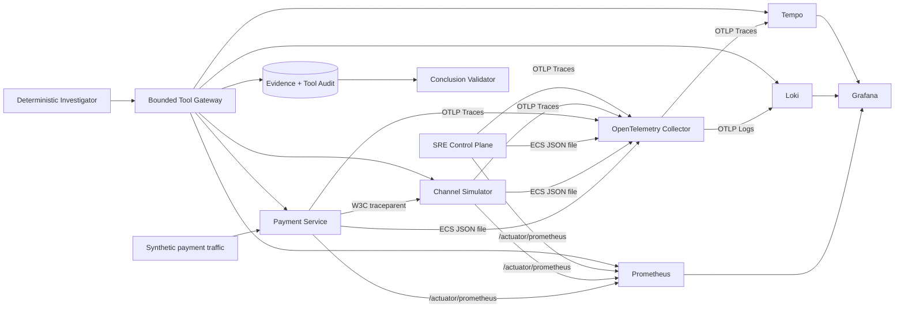
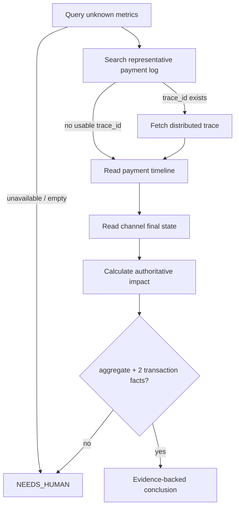

# Observability Evidence Plane

## 1. 目标

PaySRE Lab 的可观测证据平面不是给模型一个 Grafana 搜索框，而是把支付故障调查变成一条可审计的数据链：

1. 支付服务和渠道模拟器产生低基数指标、结构化日志和 W3C Trace。
2. Prometheus、Loki、Tempo 分别保存聚合信号、交易事件和调用因果关系。
3. Agent 只能调用带枚举和范围约束的只读工具，不能提交原始 PromQL、LogQL、TraceQL、URL、Header 或凭据。
4. 每次成功查询都生成 Incident-owned Evidence；每次成功或失败调用都生成 Tool Audit。
5. 结论验证器检查 Evidence 的内容、来源、Incident 归属和影响金额，而不相信模型自述。

它解决的是支付 SRE 中一个通用问题：告警是聚合的，根因却往往需要沿一笔代表交易，从指标下钻到日志，再沿 Trace 找到渠道调用，最后回到支付状态机和渠道终态做业务裁决。

## 2. 组件与数据流



Grafana 是人的观察入口，不是 Agent 的数据源，也不是测试正确性的依赖。Agent 直接访问存储后端的只读 API，减少 Dashboard 变量、用户会话和 UI 变化对调查结果的影响。

## 3. 支付遥测语义

### 3.1 指标

指标只允许稳定、低基数标签。`payment.id`、`order.id`、`merchant.id` 永远不能成为 Prometheus Label。

| 指标 | 标签 | 用途 |
|---|---|---|
| `payment_unknown_current` | `service`, `channel` | 当前尚未进入终态的支付数 |
| `payment_state_transition_total` | `service`, `channel`, `from`, `to` | 状态迁移计数 |
| `payment_attempt_outcome_total` | `service`, `channel`, `status` | 支付结果与 UNKNOWN 速率 |
| `channel_request_total` | `service`, `channel`, `result` | 渠道成功、失败和超时结果 |
| `channel_request_duration_seconds` | `service`, `channel`, `le` | 渠道延迟分布 |

Prometheus 每 5 秒抓取三个应用。当前实验保留 2 小时数据，满足可重复场景但不模拟生产长期存储。

### 3.2 日志

Spring Boot 输出 ECS JSON。支付状态变更日志携带：

- `event=PAYMENT_STATE_CHANGED`
- `paymentId`, `orderId`, `channel`
- `fromStatus`, `toStatus`, `reasonCode`
- ECS `trace.id` 和 `span.id`

应用以非 root UID/GID `10001` 写共享只写日志卷。Collector 的 `filelog` Receiver 解析 ECS JSON，`trace_parser` 把 ECS Trace 字段提升为 OTLP LogRecord 的 TraceId/SpanId，再通过 Loki 原生 OTLP 入口发送。这样 Loki 返回的 `trace_id` 是日志上下文本身携带的 ID，而不是 Agent 猜出的字符串。

日志工具只投影安全字段，单条消息最多 2 KiB，总结果最多 200 条、1 MiB 后端响应、64 KiB Evidence。

### 3.3 Trace

所有应用使用 W3C Trace Context，采样率在实验环境固定为 100%。一笔支付至少包含：

- Payment HTTP Server Span
- `payment.channel.invoke`
- Channel HTTP Server Span
- `payment.channel.process`

业务 Span 只记录 `payment.id` 和 `payment.channel` 等检索属性，不记录卡号、账号、凭据或真实资金信息。Tempo Trace 工具只保留允许列表内的 Service、Span 属性和状态，最多返回 200 个 Span、2 MiB 后端响应。

## 4. 三个可观测工具

### 4.1 `query_service_metrics`

示例输入：

```json
{
  "signal": "PAYMENT_UNKNOWN_CURRENT",
  "service": "payment-service",
  "channel": "CHANNEL_A",
  "from": "2026-07-17T01:00:00Z",
  "to": "2026-07-17T01:10:00Z",
  "step": "PT30S"
}
```

`signal` 枚举在服务端映射为固定 PromQL。窗口最多 2 小时、步长至少 15 秒、总样本最多 240、Series 最多 20。Prometheus 的 `NaN`/`Inf` 被转换为 `available=false`，不能静默当成零。

### 4.2 `search_structured_logs`

示例输入：

```json
{
  "service": "payment-service",
  "event": "PAYMENT_STATE_CHANGED",
  "minimumLevel": "INFO",
  "paymentId": "PAY-example",
  "from": "2026-07-17T01:00:00Z",
  "to": "2026-07-17T01:10:00Z",
  "limit": 20
}
```

Service、Event、Level 都是允许列表；`paymentId` 只作为结构化元数据过滤条件。客户端负责 LogQL 转义，调用者不能传入 LogQL。

### 4.3 `get_distributed_trace`

示例输入：

```json
{
  "traceId": "5b8efff798038103d269b633813fc700",
  "from": "2026-07-17T01:00:00Z",
  "to": "2026-07-17T01:10:00Z"
}
```

TraceId 必须是从已经持久化的 `STRUCTURED_LOGS` Evidence 中取得的 32 位十六进制值。调查模型不能自己生成 TraceId。Tempo 返回的 OTLP Base64 ID 会被规范化为小写十六进制。

## 5. 工具网关与 Evidence

每个工具定义包含名称、版本、风险级别、超时和最大结果字节数。网关执行顺序为：

1. 按工具输入类型反序列化，拒绝未知字段和非法枚举。
2. 在有界线程池执行；容量耗尽立即返回稳定错误码。
3. 应用工具自身超时，观测后端读取超时为 3 秒。
4. 将输出递归按 JSON Object Key 排序，数组顺序保持不变。
5. 对规范 JSON 字节计算 SHA-256。
6. 保存绑定当前 Incident 的 Evidence。
7. 无论成功失败，都保存 Tool Invocation Audit。

稳定错误码包括 `UNKNOWN_TOOL`、`INVALID_ARGUMENTS`、`TOOL_TIMEOUT`、`TOOL_CAPACITY_EXHAUSTED`、`RESULT_TOO_LARGE`、`OBSERVABILITY_BACKEND_UNAVAILABLE`、`OBSERVABILITY_MALFORMED_RESPONSE`、`OBSERVABILITY_NOT_FOUND` 和 `OBSERVABILITY_LIMIT_EXCEEDED`。后端响应正文不会进入错误码或 Agent 上下文。

只读审计接口：

| 方法 | 路径 | 返回内容 |
|---|---|---|
| `GET` | `/api/incidents/{incidentId}/evidence` | Evidence 元数据列表 |
| `GET` | `/api/incidents/{incidentId}/evidence/{evidenceId}` | Incident-owned 规范化 Evidence 内容与哈希 |
| `GET` | `/api/incidents/{incidentId}/tool-audits` | 工具名称、版本、耗时、结果、Evidence 引用和错误码 |

Evidence 详情接口会校验 Incident 归属，不能用另一个 Incident 枚举 Evidence ID。

## 6. 调查状态机

确定性调查器按以下顺序推进：



高置信度结论必须同时满足：

- 至少一份包含可用样本的 `SERVICE_METRICS`。
- 至少两种有实际内容的交易证据：`PAYMENT_TIMELINE`、`STRUCTURED_LOGS`、`DISTRIBUTED_TRACE`、`CHANNEL_FINAL_STATE`。
- 一份 `INCIDENT_IMPACT`，且结论中的笔数、金额、币种完全一致。
- Trace Evidence 的 TraceId 能在被引用的 Log Evidence 中找到。
- 所有 Evidence 属于当前 Incident，ID 不重复。

空 Series、空 Records、空 Spans、非最终渠道状态都不计为事实。Prometheus 不可用时立即转人工；Loki/Tempo 不可用时，只有 Timeline 与 Channel Final State 仍足以满足两种交易事实时才继续。

## 7. 资源与安全边界

- 调查窗口最多 2 小时。
- 单次调查最多 12 次工具调用、120 秒总截止时间。
- 连续三次没有新 Evidence、两次模型超时或两次结论校验失败都会转人工。
- 当前工具均为 `READ_ONLY`，不存在 Shell、SQL、SSH、Kubernetes 或任意 HTTP 工具。
- 不提供支付状态修改、账务记账、退款或渠道补单写操作。
- Compose 为实验环境，未实现鉴权、多租户、长期存储和高可用；真实部署必须在网关前加身份认证与细粒度授权。

## 8. 运行与验收

```bash
docker compose -f deploy/compose.yaml up -d --build --wait

PAY_SRE_COMPOSE_E2E=true mvn -B -ntp -pl e2e-tests -am \
  -Dtest=ChannelTimeoutButSuccessE2ETest \
  -Dsurefire.failIfNoSpecifiedTests=false test

docker compose -f deploy/compose.yaml down -v --remove-orphans
```

E2E 会执行 5 笔 `TIMEOUT_BUT_SUCCESS` 支付，按上限轮询指标、日志、Trace 摄入，然后断言：

- UNKNOWN Gauge 达到 5，且任何 Metric Label 都没有支付 ID。
- 状态日志含 `CHANNEL_TIMEOUT`、代表支付 ID 和真实 TraceId。
- 同一 Trace 同时含支付和渠道 Span。
- 六类 Evidence 全部存在，每个 SHA-256 都能从规范内容重新计算。
- 每项 Evidence 都有成功 Tool Audit。
- 根因、影响笔数/金额、Runbook 和人工复核策略通过 Ground Truth 评分。

## 9. 官方实现依据

- [Spring Boot Observability](https://docs.spring.io/spring-boot/reference/actuator/observability.html)
- [Spring Boot Tracing](https://docs.spring.io/spring-boot/reference/actuator/tracing.html)
- [Spring Boot Structured Logging](https://docs.spring.io/spring-boot/reference/features/logging.html)
- [OpenTelemetry File Log Receiver](https://github.com/open-telemetry/opentelemetry-collector-contrib/tree/main/receiver/filelogreceiver)
- [OpenTelemetry Trace Parser](https://github.com/open-telemetry/opentelemetry-collector-contrib/blob/main/pkg/stanza/docs/operators/trace_parser.md)
- [Prometheus HTTP API](https://prometheus.io/docs/prometheus/latest/querying/api/)
- [Loki HTTP API](https://grafana.com/docs/loki/latest/reference/loki-http-api/)
- [Loki Native OTLP](https://grafana.com/docs/loki/latest/send-data/otel/)
- [Tempo API](https://grafana.com/docs/tempo/latest/api_docs/)

本地栈固定为 Prometheus 3.12.0、Loki 3.7.2、Tempo 2.10.5、OpenTelemetry Collector Contrib 0.156.0 和 Grafana 13.1.0，避免 `latest` 漂移破坏复现实验。
