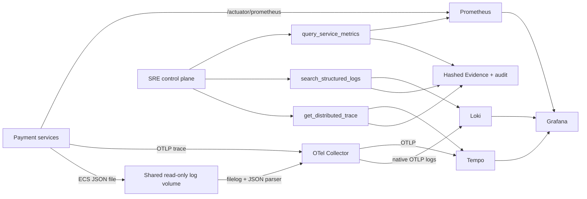

# PaySRE Lab Observability Evidence Plane Implementation Plan

> **Execution rule:** implement every task test-first, keep each backend query bounded, and do not expose raw PromQL, LogQL, SQL, shell, or unrestricted TraceQL to the investigation model.

**Goal:** Turn metrics, logs, and traces into trustworthy, correlated, machine-consumable Evidence so PaySRE can answer not only “what failed”, but also “which payment semantics were affected, how large the impact was, and which facts support the conclusion”.

**Architecture:** Each Spring Boot service emits bounded-cardinality Prometheus metrics, ECS JSON logs, and OTLP traces. Prometheus scrapes `/actuator/prometheus`; Spring Boot sends traces to OpenTelemetry Collector and then Tempo; services write ECS JSON to a shared Docker volume, Collector `filelog` reads and exports it through Loki's native OTLP endpoint. The control plane accesses the three stores only through parameterized read-only adapters and existing `ToolGateway` limits, turning every successful response into immutable, hashed Evidence.

**Tech Stack:** Java 21, Spring Boot 4.1.0, Micrometer Prometheus, Spring Boot OpenTelemetry starter, OpenTelemetry Collector Contrib, Prometheus, Loki, Tempo, Grafana, JUnit 5, AssertJ, MockRestServiceServer, Testcontainers, Docker Compose.

## 1. Product Decisions and Constraints

### 1.1 Why this is a separate product layer

Generic observability platforms expose telemetry to people. This layer exposes constrained, semantically normalized evidence to an investigator. Its reusable value is the contract between payment semantics and SRE evidence:

- `payment.id`, `order.id`, `merchant.id`, `incident.id`, and trace IDs may appear in logs and traces, never as Prometheus labels.
- Metric labels are allowlisted low-cardinality dimensions: `service`, `channel`, `result`, `status`, `from`, and `to`.
- Technical failures and business declines remain separate metrics.
- Every tool request has an absolute time range; default lookback is 15 minutes and maximum lookback is 2 hours.
- Log results default to 50 and cannot exceed 200 records.
- Metric results cannot exceed 20 series or 240 samples per series.
- A trace lookup requires a validated 16- or 32-byte lowercase hexadecimal trace ID and returns at most 200 spans.
- Raw backend query languages are internal implementation details assembled from enums and allowlists.
- Tool results remain subject to the existing 10-second timeout and 64 KiB result ceiling.
- Backend failure creates audit failure, not business Evidence; missing telemetry must never be interpreted as proof of no impact.
- Logs redact payload bodies, credentials, signatures, PAN-like values, personal data, and authorization headers at the source.

### 1.2 Official implementation basis

- Spring Boot 4.1 provides ECS, GELF, and Logstash structured logging and includes MDC/key-value pairs in JSON: <https://docs.spring.io/spring-boot/reference/features/logging.html#features.logging.structured>
- Spring Boot 4.1 supports OpenTelemetry trace export through `spring-boot-starter-opentelemetry` and `management.opentelemetry.tracing.export.otlp.*`: <https://docs.spring.io/spring-boot/reference/actuator/tracing.html>
- Spring Boot does not automatically export OpenTelemetry metrics or logs, so metrics use Prometheus scraping and logs use Collector `filelog`: <https://docs.spring.io/spring-boot/reference/actuator/observability.html>
- OpenTelemetry recommends Collector `filelog` for application logs: <https://opentelemetry.io/docs/specs/otel/logs/#open-telemetry-collector>
- Loki recommends its native OTLP endpoint rather than the legacy Loki exporter: <https://grafana.com/docs/loki/latest/send-data/otel/>
- Prometheus, Loki, and Tempo adapters follow their stable HTTP APIs: <https://prometheus.io/docs/prometheus/3.5/querying/api/>, <https://grafana.com/docs/loki/latest/reference/loki-http-api/>, and <https://grafana.com/docs/tempo/latest/api_docs/>

## 2. Target Runtime Flow



## 3. Locked Contracts

### 3.1 Metrics query

```java
public record ServiceMetricsQuery(
        MetricSignal signal,
        String service,
        String channel,
        Instant from,
        Instant to,
        Duration step) {
}

public enum MetricSignal {
    PAYMENT_UNKNOWN_CURRENT,
    PAYMENT_ATTEMPT_OUTCOME_RATE,
    PAYMENT_PROCESSING_P95,
    CHANNEL_REQUEST_ERROR_RATE,
    CHANNEL_REQUEST_P95
}
```

`PrometheusReadClient` maps each enum to a repository-owned PromQL template. Callers cannot submit expressions. Output contains the selected signal, normalized series labels, timestamp/value samples, backend warnings, and a `truncated` flag.

### 3.2 Log search

```java
public record StructuredLogSearch(
        String service,
        LogEvent event,
        LogLevel minimumLevel,
        String paymentId,
        String traceId,
        Instant from,
        Instant to,
        int limit) {
}
```

At least one of `event`, `paymentId`, or `traceId` is required. `service` and `event` come from allowlists. `LokiReadClient` owns LogQL construction and escapes literal values. Output contains timestamp, service, severity, trace/span IDs, event, payment ID, reason code, and message; arbitrary JSON fields are discarded.

### 3.3 Trace lookup

```java
public record DistributedTraceQuery(
        String traceId,
        Instant from,
        Instant to) {
}
```

`TempoReadClient` calls `/api/v2/traces/{traceId}` and returns a normalized span tree containing service, span name, parent relationship, start time, duration, status, and an allowlisted attribute subset. Raw protobuf/JSON is not copied into the model context.

### 3.4 Evidence types

| Tool | Evidence type | What it proves |
|---|---|---|
| `query_service_metrics` | `SERVICE_METRICS` | A time-windowed aggregate changed and its magnitude |
| `search_structured_logs` | `STRUCTURED_LOGS` | Specific state transitions or errors occurred |
| `get_distributed_trace` | `DISTRIBUTED_TRACE` | The cross-service causal path and timing |

## 4. Implementation Tasks

## Task 1: Add a verifiable telemetry runtime contract

**Files:**

- Modify: `payment-system/channel-simulator/pom.xml`
- Modify: `payment-system/payment-service/pom.xml`
- Modify: `sre-control-plane/pom.xml`
- Modify: all three `src/main/resources/application.yml`
- Modify: application configuration classes to use injected `RestClient.Builder`
- Test: all three application context tests
- Test: `e2e-tests/src/test/java/io/paysre/e2e/DeploymentConfigurationTest.java`

- [ ] Write failing context assertions for a Prometheus registry, an OpenTelemetry tracer/provider, and trace-propagating `RestClient` construction.
- [ ] Add `micrometer-registry-prometheus` and `spring-boot-starter-opentelemetry` to all services.
- [ ] Configure `/actuator/prometheus`, 100% sampling in the lab, bounded span limits, OTLP HTTP endpoint, W3C propagation, and environment-driven service resource attributes.
- [ ] Replace direct `RestClient.builder()` use with Spring's injected `RestClient.Builder`, preserving connect/read timeouts and allowing observation interceptors to propagate context.
- [ ] Refactor `PaymentTelemetry` to use the application-owned OpenTelemetry bean rather than `GlobalOpenTelemetry`.
- [ ] Verify unit tests do not require a running Collector and exporters fail non-fatally when disabled in the test profile.
- [ ] Run: `mvn -pl payment-system/channel-simulator,payment-system/payment-service,sre-control-plane -am test -Djava.version=18`
- [ ] Commit: `feat: establish service telemetry runtime`

## Task 2: Emit payment-safe structured logs and channel telemetry

**Files:**

- Create: `payment-system/channel-simulator/src/main/java/io/paysre/channel/ChannelMetrics.java`
- Create: `payment-system/channel-simulator/src/main/java/io/paysre/channel/ChannelTelemetry.java`
- Modify: `ChannelSimulationService.java`
- Modify: `PaymentApplicationService.java`
- Modify: all service `application.yml`
- Test: `ChannelMetricsTest.java`
- Test: `ChannelTelemetryTest.java`
- Test: `PaymentStructuredLoggingTest.java`

- [ ] Write failing tests for `channel_request_total{channel,result}`, request duration, `payment.channel.invoke`, and timeout/success state attributes.
- [ ] Add structured SLF4J key-value events for fault activation, channel final-state persistence, payment state transition, alert intake, incident creation, tool execution, and investigation completion.
- [ ] Configure ECS JSON for console and file outputs. Set service name from `spring.application.name`; preserve Boot-provided correlation IDs.
- [ ] Add only business identifiers needed for correlation; verify request bodies and secrets never appear.
- [ ] Add a regression test that rejects PAN-like values, authorization headers, signatures, and full request objects in known payment log events.
- [ ] Verify Prometheus meter IDs contain no high-cardinality labels.
- [ ] Run focused tests, then the three service module test suites.
- [ ] Commit: `feat: emit correlated payment telemetry`

## Task 3: Deploy the local observability stack as code

**Files:**

- Create: `observability/otel-collector/config.yaml`
- Create: `observability/prometheus/prometheus.yml`
- Create: `observability/prometheus/alerts.yml`
- Create: `observability/loki/config.yaml`
- Create: `observability/tempo/config.yaml`
- Create: `observability/grafana/provisioning/datasources/datasources.yaml`
- Create: `observability/grafana/provisioning/dashboards/dashboards.yaml`
- Create: `observability/grafana/dashboards/payment-incident.json`
- Modify: `deploy/compose.yaml`
- Modify: `deploy/env.example`
- Test: `DeploymentConfigurationTest.java`

- [ ] First make the deployment test require pinned Prometheus, Loki, Tempo, Collector Contrib, and Grafana services with health checks, resource limits, persistent data volumes, and an internal network.
- [ ] Configure Prometheus to scrape all three services and evaluate `PaymentUnknownHigh` with low-cardinality labels.
- [ ] Configure Collector OTLP receivers, memory limiter, batch processor, trace export to Tempo, and `filelog` JSON parsing from the shared application-log volume.
- [ ] Enrich log records with `service.name`; exclude Collector's own file output to prevent a log loop.
- [ ] Export logs to `http://loki:3100/otlp`; keep Loki single-tenant with structured metadata enabled.
- [ ] Configure Tempo local block storage, OTLP receivers, safe retention, and query frontend.
- [ ] Provision Grafana data sources with trace-to-logs and metrics-to-traces correlations.
- [ ] Provision a payment incident dashboard showing unknown count, outcome rate, latency, channel errors, recent state-change logs, and trace links.
- [ ] Mount a named log volume writable only by applications and read-only by Collector. Do not mount host `/var/lib/docker/containers`.
- [ ] Validate YAML/JSON syntax and run `docker compose -f deploy/compose.yaml config` on Docker-enabled CI.
- [ ] Commit: `feat: add local observability stack`

## Task 4: Implement the bounded Prometheus adapter

**Files:**

- Create: `sre-control-plane/src/main/java/io/paysre/control/observability/MetricSignal.java`
- Create: `.../ServiceMetricsQuery.java`
- Create: `.../MetricSeries.java`
- Create: `.../MetricSample.java`
- Create: `.../PrometheusReadClient.java`
- Create: `.../HttpPrometheusReadClient.java`
- Test: `.../HttpPrometheusReadClientTest.java`

- [ ] Write failing HTTP tests proving enum-to-PromQL mapping, URL encoding, exact start/end/step values, response normalization, warning preservation, and non-2xx/invalid JSON handling.
- [ ] Validate service/channel against fixed allowlists; reject future ranges, inverted ranges, ranges over two hours, steps below 15 seconds, and excessive sample counts before I/O.
- [ ] Add a backend `limit=20` and enforce 20 series/240 samples locally even if the backend ignores it.
- [ ] Treat NaN and infinity as explicit unavailable samples, not zero.
- [ ] Return an immutable normalized result with `truncated` and warnings.
- [ ] Commit: `feat: add bounded prometheus evidence client`

## Task 5: Implement bounded Loki and Tempo adapters

**Files:**

- Create: `.../StructuredLogSearch.java`, `LogEvent.java`, `LogLevel.java`, `StructuredLogRecord.java`
- Create: `.../LokiReadClient.java`, `HttpLokiReadClient.java`
- Create: `.../DistributedTraceQuery.java`, `TraceSpan.java`, `DistributedTrace.java`
- Create: `.../TempoReadClient.java`, `HttpTempoReadClient.java`
- Test: `.../HttpLokiReadClientTest.java`
- Test: `.../HttpTempoReadClientTest.java`

- [ ] Write failing Loki tests for required selectors, escaping, nanosecond time bounds, backward order, maximum limit, native OTLP label names, and safe field projection.
- [ ] Reject empty searches and unsupported identifiers before I/O. Never concatenate an unescaped caller string into LogQL.
- [ ] Write failing Tempo tests for trace-ID validation, v2 endpoint construction, time bounds, resource/span normalization, parent links, error status, and 200-span truncation.
- [ ] Project only allowlisted attributes (`payment.id`, `order.id`, `merchant.id`, `payment.channel`, HTTP route/method/status, messaging system/destination, exception type).
- [ ] Distinguish not-found, backend-unavailable, malformed-response, and limit-exceeded errors so the gateway can audit a stable error code later.
- [ ] Commit: `feat: add bounded log and trace evidence clients`

## Task 6: Expose the three read-only Agent tools

**Files:**

- Create: `QueryServiceMetricsTool.java`
- Create: `SearchStructuredLogsTool.java`
- Create: `GetDistributedTraceTool.java`
- Modify: `ControlPlaneApplication.java`
- Modify: `ToolGateway.java`
- Modify: `application.yml`
- Test: `ObservabilityToolsTest.java`
- Test: `ToolGatewayTest.java`

- [ ] Write failing handler tests for definitions, input validation, normalized outputs, and backend error propagation.
- [ ] Register three typed clients and handlers with 3-second backend read timeouts and the existing bounded tool executor.
- [ ] Add explicit Evidence mappings: `SERVICE_METRICS`, `STRUCTURED_LOGS`, and `DISTRIBUTED_TRACE`.
- [ ] Preserve the existing SHA-256, incident ownership, 64 KiB ceiling, timeout, capacity rejection, and complete audit behavior.
- [ ] Map typed backend failures to stable audit codes without leaking backend response bodies.
- [ ] Verify no HTTP mutation method exists in any observability client.
- [ ] Commit: `feat: expose observability evidence tools`

## Task 7: Make the deterministic investigation use telemetry evidence

**Files:**

- Modify: `StubInvestigationModel.java`
- Modify: `ConclusionValidator.java`
- Modify: investigation tests
- Modify: `fault-scenarios/channel-timeout-but-success-v1.yaml`
- Modify: evaluator tests

- [ ] Extend the deterministic sequence to query unknown-rate metrics, find the representative payment's state-change log, obtain its trace ID, fetch the distributed trace, then use the existing timeline/channel/impact tools.
- [ ] Never use a trace ID invented by the model; it must come from persisted Evidence.
- [ ] Require at least one aggregate (`SERVICE_METRICS`) and two transaction-specific facts among timeline/log/trace/channel Evidence for a high-confidence conclusion.
- [ ] Keep `INCIDENT_IMPACT` authoritative for counts and money.
- [ ] If an observability backend is unavailable, continue with remaining sources only when the scenario's minimum evidence rule can still be met; otherwise transition to `NEEDS_HUMAN`.
- [ ] Add Ground Truth expectations for telemetry Evidence without making Grafana itself a correctness dependency.
- [ ] Commit: `feat: investigate incidents across telemetry signals`

## Task 8: Prove the vertical slice through Docker

**Files:**

- Modify: `ChannelTimeoutButSuccessE2ETest.java`
- Create: `ObservabilityEvidenceE2ETest.java` or fold checks into the existing scenario test
- Modify: `.github/workflows/ci.yml` if additional startup time is required
- Modify: `README.md`
- Create: `docs/architecture/observability-evidence-plane.md`

- [ ] Start the full Compose stack in CI and wait for readiness of Prometheus, Loki, Tempo, Collector, Grafana, and application services.
- [ ] Run the seeded timeout-but-success traffic and wait with bounded polling for metric, log, and trace ingestion.
- [ ] Assert the three tool Evidence types exist, the trace includes payment and channel spans, logs include the UNKNOWN transition, and metrics show the unknown count without payment IDs as labels.
- [ ] Assert each Evidence hash matches its canonical persisted content and every tool call has an audit record.
- [ ] Assert the final root cause, affected payment count/amount, Runbook, and human-review flag still pass the scenario evaluator.
- [ ] Document `docker compose up --build`, the scenario command, Grafana URL, tool request examples, architecture, limitations, and troubleshooting.
- [ ] Run local non-Docker verification: `mvn -B -ntp clean verify -Djava.version=18`.
- [ ] Run authoritative CI verification on Java 21 with Docker; retain test reports on failure.
- [ ] Commit: `test: prove observability evidence scenario`

## 5. Acceptance Criteria

- [ ] All three applications expose Prometheus metrics and emit ECS JSON logs plus correlated OTLP traces.
- [ ] A payment request and downstream channel request share the same W3C trace.
- [ ] `payment.id` is searchable in logs/traces and absent from all Prometheus labels.
- [ ] Prometheus, Loki, Tempo, Collector, and Grafana start from pinned Compose configuration with health checks.
- [ ] Each backend has a typed, read-only, time-bounded client with deterministic unit tests.
- [ ] Agent tools never accept raw PromQL, LogQL, TraceQL, URLs, headers, or credentials.
- [ ] Every successful observability query creates incident-owned, hashed Evidence and a complete tool audit.
- [ ] Missing or malformed telemetry fails closed; it never silently becomes a zero or an exonerating fact.
- [ ] The seeded scenario proves metric, log, trace, payment timeline, channel final state, and impact evidence in one investigation.
- [ ] Java 21 Docker CI passes the full reactor and scenario.

## 6. Deliberate Non-goals

- Anomaly detection or learned thresholds; alerts remain deterministic.
- Free-form natural-language-to-PromQL/LogQL/TraceQL.
- Long-term telemetry retention, multi-tenancy, production authentication, or production scaling.
- Grafana as the Agent data source; Agent tools query storage backends directly.
- Model-based impact calculation or direct database access.
- Action execution, live LLM integration, React console, and benchmark leaderboard; each remains a later independently reviewed phase.

## 7. Recommended Commit Sequence

1. `docs: plan observability evidence plane`
2. `feat: establish service telemetry runtime`
3. `feat: emit correlated payment telemetry`
4. `feat: add local observability stack`
5. `feat: add bounded prometheus evidence client`
6. `feat: add bounded log and trace evidence clients`
7. `feat: expose observability evidence tools`
8. `feat: investigate incidents across telemetry signals`
9. `test: prove observability evidence scenario`

