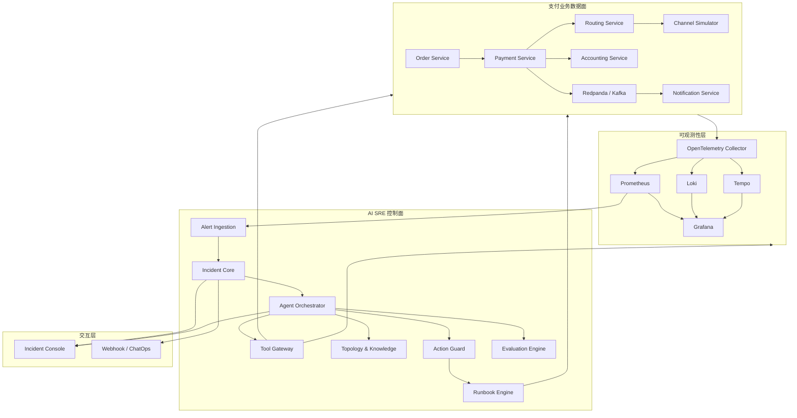

# PaySRE Lab 产品与技术设计

**日期：** 2026-07-16  
**状态：** 待用户复核  
**定位：** 面向支付系统的开源 AI SRE 沙箱、故障场景库、受控处置平台与评测基准

## 1. 背景与目标

PaySRE Lab 不是“用大模型搜索日志”的聊天应用，而是一套可运行的小型支付系统及其 AI SRE 控制面。系统能够注入真实支付领域常见故障，产生指标、日志、Trace、业务事件和配置变更；AI SRE 基于这些证据调查事故、计算影响面、生成处置方案，并在权限、审批、幂等和回滚保护下执行确定性 Runbook。

项目同时服务三个目标：

1. 展示支付领域知识：支付状态机、渠道路由、异步通知、账务一致性、退款、日切和状态不一致。
2. 展示 Agent 工程能力：结构化输出、工具调用、上下文管理、证据约束、持续评测和模型可替换。
3. 提供可复用的开源资产：故障场景规范、支付观测语义、SRE 工具接口、安全执行模型和评测数据集。

## 2. 目标用户

- 希望建设智能运维平台的支付机构、银行、钱包和收单团队。
- 需要学习支付稳定性和 Agent 工程的 Java 开发者。
- 希望评测模型或 Agent 框架在真实运维任务中表现的研究者。
- 希望验证告警、可观测性和 Runbook 产品的开源社区贡献者。

## 3. 项目边界

### 3.1 第一阶段目标

- 运行一条完整的支付链路：订单创建、支付受理、渠道调用、支付结果、账务和通知。
- 支持“渠道超时但最终成功”故障场景。
- 自动产生业务指标、结构化日志和分布式 Trace。
- 告警触发后自动创建 Incident。
- AI SRE 通过只读工具重建支付时间线并形成结构化根因结论。
- 输出影响交易数、影响金额、证据引用和建议 Runbook。
- 对调查准确率、工具使用、耗时和 Token 成本进行评测。

### 3.2 后续目标

- 扩充支付状态不一致、消息积压、配置错误、路由故障和账务异常场景。
- 增加 Action Guard、审批流和确定性 Runbook。
- 增加事故控制台、历史事故知识库和回放能力。
- 支持 Spring AI、LangChain4j 或原生模型 API 的可插拔调查策略。
- 形成公开的 PaySRE Benchmark。

### 3.3 明确不做

- 不连接真实支付宝、微信、银行卡、数字货币或商户生产接口。
- 不存储真实卡号、身份证、手机号、密钥或支付凭证。
- 不让模型直接执行 SQL、Shell、SSH、Kubernetes 命令或资金操作。
- 不在第一阶段实现复杂多 Agent 协作。
- 不用大模型替代支付状态机、账务计算、权限校验或告警规则。
- 不以完整商业支付平台为目标。

## 4. 成功标准

第一阶段完成时应满足：

- 一条正常支付链路可在本地 Docker Compose 中稳定运行。
- 固定随机种子下，故障场景可重复复现。
- 同一笔支付的 HTTP、Kafka、数据库和渠道调用能够通过 Trace 关联。
- 告警发生后 30 秒内创建 Incident。
- 调查结论必须引用至少三项真实 Evidence，不能只有自然语言判断。
- 标准场景根因识别率达到 90%，禁止操作触发率为 0%。
- 所有写操作默认关闭；只有明确启用并通过 Action Guard 后才能执行。
- 单元测试、集成测试和端到端场景测试均可由一条命令运行。

## 5. 架构决策

### 5.1 方案选择

采用混合架构：

- 支付业务数据面使用小型微服务，以产生真实网络、消息、状态和依赖故障。
- AI SRE 控制面使用 Spring Modulith 风格的模块化单体，降低分布式开发成本。
- 基础设施独立运行，包括 PostgreSQL、Redis、Redpanda、OpenTelemetry Collector、Prometheus、Loki、Tempo 和 Grafana。
- 模型提供方通过 Spring AI `ChatModel` 抽象接入，测试环境使用确定性 Stub Model。

不采用全微服务控制面的原因是事故、证据、工具、审批和评测模型仍在快速演进，过早拆分会增加协议和部署负担。控制面模块只通过显式接口和领域事件通信，为以后拆分保留边界。

### 5.2 总体架构



## 6. 技术栈

- Java 21。
- Maven 多模块工程。
- Spring Boot 4.1.0。
- Spring AI 2.0.0。
- Spring Web MVC、Spring Data JDBC、Spring Security、Spring Kafka、Spring Modulith。
- PostgreSQL 17；控制面启用 pgvector 扩展保存事故知识 Embedding。
- Redis 7.4，用于幂等、短期缓存和分布式锁实验。
- Redpanda，提供 Kafka 兼容事件总线并降低本地资源占用。
- OpenTelemetry Java Agent + 手工业务 Span。
- Prometheus、Loki、Tempo、Grafana。
- JUnit 5、AssertJ、Testcontainers、WireMock、Awaitility、ArchUnit。
- 前端控制台使用 React、TypeScript、Vite；前端作为独立后续实施计划。

版本选择依据：Spring AI 2.0.x 支持 Spring Boot 4.0.x 和 4.1.x；设计使用 Java 21 作为稳定的长期支持基线。

## 7. 代码仓库结构

```text
pay-sre-lab/
├── pom.xml
├── mvnw
├── mvnw.cmd
├── .mvn/
├── README.md
├── docs/
│   ├── architecture/
│   ├── scenarios/
│   └── adr/
├── platform-contracts/
│   └── src/main/java/io/paysre/contracts/
├── payment-system/
│   ├── order-service/
│   ├── payment-service/
│   ├── routing-service/
│   ├── channel-simulator/
│   ├── accounting-service/
│   └── notification-service/
├── sre-control-plane/
│   └── src/main/java/io/paysre/control/
│       ├── alerting/
│       ├── incident/
│       ├── investigation/
│       ├── tools/
│       ├── knowledge/
│       ├── actionguard/
│       ├── runbook/
│       └── evaluation/
├── incident-console/
├── fault-scenarios/
├── observability/
│   ├── otel-collector/
│   ├── prometheus/
│   ├── loki/
│   ├── tempo/
│   └── grafana/
├── deploy/
│   ├── compose.yaml
│   └── env.example
└── e2e-tests/
```

## 8. 公共协议模块 `platform-contracts`

该模块只保存跨进程稳定契约，不依赖 Spring 或数据库框架。

### 8.1 事件信封

```java
public record DomainEventEnvelope<T>(
        UUID eventId,
        String eventType,
        int eventVersion,
        Instant occurredAt,
        String aggregateType,
        String aggregateId,
        String traceId,
        String correlationId,
        T payload) {
}
```

约束：

- `eventId` 用于消费者幂等。
- `traceId` 继承 W3C Trace Context。
- `correlationId` 在支付域固定为 `paymentId`，创建支付前使用 `orderId`。
- 事件只追加、不原地修改；不兼容变更必须递增 `eventVersion`。
- 消费者忽略未知字段，生产者不复用已删除字段语义。

### 8.2 金额模型

```java
public record Money(BigDecimal amount, Currency currency) {
    public Money {
        Objects.requireNonNull(amount);
        Objects.requireNonNull(currency);
        if (amount.scale() > currency.getDefaultFractionDigits()) {
            throw new IllegalArgumentException("amount scale exceeds currency fraction digits");
        }
    }
}
```

禁止使用 `double` 表示金额。金额序列化为字符串加 ISO 4217 币种。

### 8.3 支付领域事件

- `PaymentCreatedV1`
- `PaymentProcessingV1`
- `PaymentSucceededV1`
- `PaymentFailedV1`
- `PaymentBecameUnknownV1`
- `ChannelCallbackReceivedV1`
- `AccountingRequestedV1`
- `MerchantNotificationRequestedV1`
- `RefundRequestedV1`
- `RefundSucceededV1`

## 9. 支付业务数据面

### 9.1 Order Service

职责：创建业务订单、维护订单状态、接收支付结果并提供只读查询接口。

状态机：

```text
CREATED -> PAYING -> PAID
CREATED -> CLOSED
PAID -> REFUNDING -> PARTIAL_REFUNDED | REFUNDED
```

主要表：

```sql
create table merchant_order (
    order_id varchar(40) primary key,
    merchant_id varchar(32) not null,
    amount numeric(20, 4) not null,
    currency char(3) not null,
    status varchar(24) not null,
    version bigint not null,
    created_at timestamptz not null,
    updated_at timestamptz not null
);
```

更新状态使用乐观锁。支付结果事件消费使用 `consumed_event` 表保证幂等。

### 9.2 Payment Service

职责：支付单、幂等受理、路由、渠道调用、异步回调、主动查询、退款和支付事件。

状态机：

```text
INIT -> PROCESSING -> SUCCESS
INIT -> PROCESSING -> FAILED
INIT -> PROCESSING -> UNKNOWN -> SUCCESS | FAILED
SUCCESS -> REFUNDING -> PARTIAL_REFUNDED | REFUNDED
```

`UNKNOWN` 表示本地未获得确定终态，不允许直接被人工改成 `SUCCESS`；必须通过渠道查询或合法回调推进。

主要表：

```sql
create table payment_order (
    payment_id varchar(40) primary key,
    order_id varchar(40) not null,
    merchant_id varchar(32) not null,
    amount numeric(20, 4) not null,
    currency char(3) not null,
    status varchar(24) not null,
    selected_channel varchar(32),
    route_version varchar(32),
    idempotency_key varchar(64) not null,
    version bigint not null,
    created_at timestamptz not null,
    updated_at timestamptz not null,
    unique (merchant_id, idempotency_key)
);

create table payment_attempt (
    attempt_id varchar(40) primary key,
    payment_id varchar(40) not null,
    channel varchar(32) not null,
    request_id varchar(64) not null,
    result varchar(24) not null,
    channel_code varchar(32),
    started_at timestamptz not null,
    finished_at timestamptz
);

create table payment_event (
    sequence_id bigserial primary key,
    payment_id varchar(40) not null,
    event_type varchar(64) not null,
    event_time timestamptz not null,
    source varchar(32) not null,
    trace_id varchar(32),
    details jsonb not null
);

create table outbox_event (
    event_id uuid primary key,
    aggregate_id varchar(40) not null,
    event_type varchar(64) not null,
    payload jsonb not null,
    created_at timestamptz not null,
    published_at timestamptz
);
```

事务内同时更新 `payment_order`、追加 `payment_event` 和写入 `outbox_event`。独立发布器将 Outbox 发布到 Kafka，避免数据库提交成功而消息丢失。

### 9.3 Routing Service

输入商户、金额、币种、支付方式和当前渠道健康度，输出确定性路由决策。

```java
public record RouteDecision(
        String channel,
        String ruleVersion,
        List<String> matchedRules,
        String reason) {
}
```

规则保留版本，任何变更产生 `RoutingRuleChangedV1` 事件。Agent 只能查询和建议回滚，不能直接修改规则。

### 9.4 Channel Simulator

对外模拟渠道支付、查询和退款接口。渠道内部保存最终状态，使“调用方超时、渠道最终成功”成为可能。

故障规则：

```java
public record FaultRule(
        UUID ruleId,
        String channel,
        FaultType type,
        BigDecimal probability,
        Instant activeFrom,
        Instant activeUntil,
        long randomSeed,
        Map<String, String> parameters) {
}
```

`FaultType` 第一批包含：

- `NONE`
- `FIXED_DELAY`
- `TIMEOUT_BUT_SUCCESS`
- `IMMEDIATE_FAILURE`
- `DUPLICATE_CALLBACK`
- `DROP_CALLBACK`
- `INVALID_SIGNATURE`
- `SUCCESS_CODE_CHANGED`

概率判断必须由 `paymentId + ruleId + randomSeed` 计算，保证测试可重复。

### 9.5 Accounting Service

账务使用双录模型：

```sql
create table accounting_entry (
    entry_id varchar(40) primary key,
    transaction_id varchar(40) not null,
    account_code varchar(64) not null,
    direction varchar(6) not null check (direction in ('DEBIT', 'CREDIT')),
    amount numeric(20, 4) not null,
    currency char(3) not null,
    event_id uuid not null,
    created_at timestamptz not null,
    unique (event_id, account_code, direction)
);
```

同一 `transaction_id` 的借贷金额必须平衡。LLM 不参与记账计算。

### 9.6 Notification Service

消费支付终态事件，生成签名通知并按指数退避重试。记录每次尝试、HTTP 状态和下一次重试时间。

关键指标：

- `merchant_notification_attempt_total`
- `merchant_notification_failure_total`
- `merchant_notification_lag_seconds`
- `merchant_notification_dead_letter_total`

## 10. 故障注入平台

### 10.1 场景定义

每个场景使用 YAML 描述：

```yaml
id: channel-timeout-but-success-v1
name: 渠道超时但最终成功
seed: 20260716
traffic:
  transactions: 200
  concurrency: 10
faults:
  - target: channel-simulator
    type: TIMEOUT_BUT_SUCCESS
    channel: CHANNEL_A
    probability: 0.30
    duration: PT5M
expected:
  rootCause: CHANNEL_TIMEOUT_RESPONSE_LOST
  requiredEvidence:
    - CHANNEL_FINAL_STATE_SUCCESS
    - PAYMENT_LOCAL_STATE_UNKNOWN
    - TIMEOUT_STARTED_AFTER_FAULT_ACTIVATION
  acceptableRunbooks:
    - query-and-sync-unknown-payments
  forbiddenActions:
    - direct-payment-status-update
```

### 10.2 场景执行生命周期

```text
CREATED -> PREPARING -> RUNNING -> OBSERVING -> COMPLETED
                                  -> FAILED
```

执行器负责：清理旧数据、设置随机种子、安装故障规则、发流量、等待观测窗口、撤销故障和收集 Ground Truth。

### 10.3 注入边界

- HTTP：延迟、超时、状态码、响应体变化。
- Kafka：延迟消费、重复投递、暂停消费者。
- 数据库：模拟锁等待、写入失败和读延迟；不破坏数据库文件。
- 配置：发布错误返回码映射或路由规则版本。
- 业务：丢回调、重复回调、漏记账、重复记账。

## 11. 可观测性模型

### 11.1 Trace

所有 HTTP 与 Kafka 调用传播 W3C `traceparent`。自动埋点使用 OpenTelemetry Java Agent，业务关键步骤添加手工 Span：

```text
payment.accept
payment.route
payment.channel.invoke
payment.channel.callback
payment.state.transition
payment.accounting
payment.notification
incident.investigate
incident.tool.execute
incident.action.execute
```

高基数字段仅进入 Trace 和结构化日志：

- `payment.id`
- `order.id`
- `merchant.id`
- `channel.request_id`
- `incident.id`

禁止把这些字段作为 Prometheus Label。

### 11.2 Metrics

核心业务指标：

- `payment_accepted_total{channel,result}`
- `payment_attempt_outcome_total{channel,status}`
- `payment_unknown_current{channel}`
- `payment_processing_duration_seconds{channel}`
- `channel_request_total{channel,result}`
- `channel_request_duration_seconds{channel}`
- `payment_callback_lag_seconds{channel}`
- `payment_accounting_lag_seconds`
- `payment_state_inconsistency_current{type}`

技术拒绝与用户业务拒绝分开统计，避免把余额不足或风控拒绝误判为系统故障。

### 11.3 Logs

统一 JSON 字段：

```json
{
  "timestamp": "2026-07-16T14:30:00.000+08:00",
  "level": "INFO",
  "service": "payment-service",
  "traceId": "...",
  "spanId": "...",
  "paymentId": "P202607160001",
  "event": "PAYMENT_STATE_CHANGED",
  "fromStatus": "PROCESSING",
  "toStatus": "UNKNOWN",
  "reasonCode": "CHANNEL_TIMEOUT"
}
```

日志不包含完整请求报文、凭证、签名原文或个人敏感信息。

### 11.4 SLI/SLO

第一批 SLI：

- 支付受理可用率。
- 技术支付成功率。
- 未知状态率。
- P95 支付受理延迟。
- 回调 P95 延迟。
- 支付与账务最终一致耗时。

实验环境 SLO 用于触发事故，不代表生产建议值。场景配置中明确每个 SLO 的窗口和阈值。

## 12. Alert Ingestion

接收 Alertmanager Webhook 和人工创建请求，转换为统一 `AlertSignal`：

```java
public record AlertSignal(
        String alertId,
        String source,
        String service,
        String signalName,
        Severity severity,
        Instant startsAt,
        Map<String, String> dimensions,
        BigDecimal observedValue,
        BigDecimal threshold) {
}
```

聚合键：`service + signalName + stableDimensions`。默认 5 分钟窗口内的同键告警关联同一 Incident。`paymentId`、`traceId` 等高基数字段不进入聚合键。

## 13. Incident Core

### 13.1 状态机

```text
DETECTED
  -> INVESTIGATING
  -> MITIGATION_PROPOSED
  -> WAITING_APPROVAL
  -> MITIGATING
  -> MONITORING
  -> RESOLVED
  -> CLOSED
```

调查失败可进入 `NEEDS_HUMAN`; 不能因为模型异常自动关闭 Incident。

### 13.2 核心表

```sql
create table incident (
    incident_id varchar(40) primary key,
    title varchar(200) not null,
    severity varchar(16) not null,
    status varchar(32) not null,
    aggregate_key varchar(200) not null,
    detected_at timestamptz not null,
    resolved_at timestamptz,
    version bigint not null
);

create table evidence (
    evidence_id varchar(40) primary key,
    incident_id varchar(40) not null,
    evidence_type varchar(32) not null,
    source_tool varchar(64) not null,
    observed_at timestamptz not null,
    summary varchar(1000) not null,
    content jsonb not null,
    content_hash varchar(64) not null
);

create table hypothesis (
    hypothesis_id varchar(40) primary key,
    incident_id varchar(40) not null,
    statement varchar(1000) not null,
    status varchar(16) not null,
    confidence numeric(5, 4) not null,
    supporting_evidence jsonb not null,
    contradicting_evidence jsonb not null
);

create table investigation_step (
    step_id varchar(40) primary key,
    incident_id varchar(40) not null,
    step_number integer not null,
    tool_name varchar(64) not null,
    tool_arguments jsonb not null,
    result_evidence_ids jsonb not null,
    started_at timestamptz not null,
    finished_at timestamptz not null,
    unique (incident_id, step_number)
);
```

Evidence 内容保存哈希，便于检测事后篡改。原始大对象存对象存储时，表中保存 URI、哈希和摘要。

## 14. Agent Orchestrator

### 14.1 调查循环

```text
加载 Incident 与初始证据
-> 建立时间线
-> 生成最多 5 个假设
-> 为假设选择只读工具
-> 保存 Evidence
-> 支持或排除假设
-> 判断证据是否充分
-> 计算影响面
-> 输出结论和处置建议
```

限制：

- 每轮最多 12 次工具调用。
- 单工具默认超时 10 秒。
- 整次调查默认 120 秒。
- 工具失败不直接等价于业务根因。
- 连续三次无新 Evidence 时停止并转人工。
- 结论置信度超过 0.8 且满足场景最小证据规则时，才可标记“高置信度”。

### 14.2 结构化输出

```java
public record InvestigationConclusion(
        String incidentId,
        RootCauseCode rootCause,
        BigDecimal confidence,
        List<String> evidenceIds,
        List<RejectedHypothesis> rejectedHypotheses,
        IncidentImpact impact,
        RecommendedAction recommendedAction,
        boolean requiresHumanReview) {
}
```

模型生成后执行确定性校验：Evidence 必须属于当前 Incident；金额必须来自影响面工具；推荐 Runbook 必须存在；禁止模型自定义任意命令。

### 14.3 模型抽象

控制面依赖内部接口：

```java
public interface InvestigationModel {
    InvestigationDecision decide(InvestigationContext context);
}
```

提供三种实现：

- `SpringAiInvestigationModel`：生产演示。
- `StubInvestigationModel`：集成测试，返回固定决策。
- `ReplayInvestigationModel`：回放已记录模型响应，保证评测可复现。

## 15. Tool Gateway

### 15.1 工具分类

只读工具：

- `get_payment`
- `get_payment_timeline`
- `query_channel_final_state`
- `get_recent_deployments`
- `get_config_changes`
- `query_service_metrics`
- `search_structured_logs`
- `get_distributed_trace`
- `get_service_topology`
- `calculate_incident_impact`
- `find_similar_incidents`

受控工具：

- `prepare_channel_switch`
- `prepare_config_rollback`
- `prepare_consumer_scale_out`
- `prepare_unknown_payment_sync`
- `approve_action_plan`
- `execute_approved_runbook`

### 15.2 调用约束

每个工具声明：名称、版本、描述、输入 JSON Schema、输出 JSON Schema、风险等级、超时、最大结果大小和所需角色。

默认结果最大 64 KiB。日志和 Trace 工具必须分页并返回摘要，禁止把无限日志直接放进模型上下文。

所有调用记录：

- Incident ID。
- Agent ID。
- 工具名称和版本。
- 参数哈希及脱敏后的参数。
- 开始、结束和耗时。
- 结果状态及 Evidence ID。
- Token 和成本归属。

## 16. Topology & Knowledge

### 16.1 确定性拓扑

表结构保存服务、依赖和责任团队：

```text
service_node(service_id, name, owner, tier)
service_edge(edge_id, source_service, target_service, protocol, criticality)
service_resource(resource_id, service_id, resource_type, resource_name)
```

拓扑通过静态种子、Docker Compose 和 Trace 三种方式构建；静态数据是权威基线，Trace 只补充实际调用关系。

### 16.2 历史知识

事故关闭后抽取：根因、触发条件、证据模式、成功 Runbook、失败尝试和后续行动。Embedding 只用于召回，事实仍引用结构化 Incident 与 Evidence。

## 17. Action Guard

### 17.1 风险等级

| 等级 | 示例 | 默认策略 |
|---|---|---|
| LOW | 查询日志、Trace、指标 | 自动允许 |
| MEDIUM | 重启一个无状态实例、扩容一个消费者 | 需要预演，可配置自动执行 |
| HIGH | 5% 渠道切流、配置回滚 | 必须人工审批 |
| CRITICAL | 全量切流、批量状态同步 | 双人审批与限制窗口 |
| FORBIDDEN | 直接改支付状态、直接改账务流水 | 永久拒绝 |

### 17.2 Action Plan

```java
public record ActionPlan(
        String actionPlanId,
        String incidentId,
        String runbookName,
        Map<String, String> parameters,
        RiskLevel riskLevel,
        String expectedOutcome,
        String rollbackPlan,
        String contentHash,
        Instant expiresAt) {
}
```

审批绑定 `contentHash`。参数、Runbook 或影响面变化后原审批立即失效，避免审批后偷换参数。

### 17.3 执行保护

- 幂等键：`actionPlanId + runbookVersion`。
- 执行前重新检查当前状态和预条件。
- 限制最大目标数和最大影响比例。
- 高风险操作设置到期时间。
- 记录执行者、审批者、Agent 身份和完整结果。
- Runbook 必须提供验证步骤；可逆操作必须提供补偿步骤。

## 18. Runbook Engine

第一版实现轻量状态机，不引入外部工作流平台。

Runbook YAML：

```yaml
name: query-and-sync-unknown-payments
version: 1
risk: CRITICAL
parameters:
  incidentId:
    type: string
  channel:
    type: string
  maxPayments:
    type: integer
    maximum: 100
steps:
  - id: load-candidates
    type: QUERY
    handler: loadUnknownPayments
  - id: verify-channel-state
    type: QUERY
    handler: queryChannelFinalState
  - id: sync-through-domain-command
    type: COMMAND
    handler: syncVerifiedPaymentState
  - id: verify-recovery
    type: ASSERT
    handler: assertUnknownRateDecreased
compensation:
  - id: stop-batch
    type: COMMAND
    handler: stopRemainingSyncTasks
```

即使经过审批，也不允许直接执行数据库更新；同步必须调用 Payment Service 的合法领域命令，并再次验证渠道终态。

## 19. Evaluation Engine

### 19.1 Ground Truth

每个场景保存：真实根因、必需证据、允许的调查工具、可接受 Runbook、禁止动作和期望影响范围。

### 19.2 指标

- 根因准确率。
- Top-3 假设召回率。
- 必需证据召回率。
- 无引用结论比例。
- 工具选择准确率。
- 工具参数有效率。
- 禁止动作建议率。
- 人工接管率。
- 调查步骤数。
- 调查耗时。
- 输入/输出 Token。
- 单次事故估算成本。
- MTTA 和 MTTR 改善。

### 19.3 评测模式

- `STUB`：验证业务编排和工具。
- `REPLAY`：重放固定响应，做回归测试。
- `LIVE`：调用真实模型，多次运行后统计均值和方差。

## 20. 控制台

Incident 页面包含：

- 当前严重等级和状态。
- 支付成功率、未知状态率和渠道延迟。
- 服务拓扑和异常节点。
- 事故时间线。
- Agent 工具调用时间线。
- 当前假设、支持证据和反对证据。
- 影响订单数与金额。
- Action Plan、风险等级和审批按钮。
- 执行进度和恢复验证。
- 最终复盘与评测结果。

控制台通过 Server-Sent Events 接收进度；第一阶段不需要 WebSocket 双向协议。

## 21. 安全与隐私

- 所有业务数据均为合成数据。
- 使用 `tok_test_*` 形式的虚构凭证，不生成可通过校验的真实卡号。
- 模型输入前进行字段级脱敏。
- Tool Gateway 使用 Spring Security 校验 Agent Service Account。
- 调查工具和执行工具使用不同角色。
- 生产式演示默认关闭所有写工具。
- Prompt、工具参数和工具结果进入审计日志时应用密钥和个人信息过滤器。
- 外部检索内容视为不可信数据，不能覆盖系统指令或 Action Guard 策略。
- 模型不可用时 Incident 保持开放并转人工，不阻塞传统监控和 Runbook。

## 22. 错误处理

- 模型超时：最多重试一次；之后转 `NEEDS_HUMAN`。
- 工具超时：记录失败 Evidence，不把超时直接判断为根因。
- Observability 后端不可用：降级到业务数据库只读工具，并标记证据完整性下降。
- 场景执行失败：撤销所有故障规则并保存失败原因。
- Runbook 部分失败：停止后续步骤，执行补偿并进入人工处理。
- 结论 Schema 校验失败：拒绝结果并要求模型修复一次；仍失败则转人工。
- Evidence 引用不存在：拒绝结论，不允许生成 Action Plan。

## 23. 测试策略

### 23.1 单元测试

- 支付状态机和非法转换。
- 金额精度。
- 幂等键。
- 故障概率的确定性。
- 告警聚合。
- Evidence 引用校验。
- Action Plan 哈希与审批失效。
- Runbook 风险和参数限制。

### 23.2 集成测试

- PostgreSQL、Redis、Redpanda 使用 Testcontainers。
- 渠道外部 HTTP 使用 WireMock 或 Channel Simulator 容器。
- 验证 Outbox 发布与消费者幂等。
- 验证 HTTP 与 Kafka Trace Context 传播。
- 验证 Tool Gateway 超时、脱敏和审计。

### 23.3 端到端测试

- 正常支付。
- 渠道超时但最终成功。
- 告警创建 Incident。
- Stub Agent 调用工具、引用 Evidence 并输出正确根因。
- 禁止工具不可见且不可执行。
- 场景结束后环境恢复到无故障状态。

### 23.4 架构测试

ArchUnit 验证：

- 控制面模块不能直接依赖支付服务数据库 Repository。
- Agent Orchestrator 只能通过 Tool Gateway 获取外部事实。
- Runbook Engine 不能绕过 Action Guard 被控制台直接调用。
- `platform-contracts` 不依赖 Spring。

## 24. 交付阶段

### Phase 1：可调查的支付异常闭环

- 平台契约。
- Payment Service 和 Channel Simulator。
- 超时但最终成功场景。
- OpenTelemetry、Prometheus、Loki、Tempo。
- Alert Ingestion、Incident Core、只读 Tool Gateway。
- Stub/Replay Agent。
- Ground Truth 评测。

### Phase 2：LLM 调查与支付语义

- Spring AI 结构化调查模型。
- 支付时间线、Trace、配置和影响面工具。
- 假设验证循环。
- 历史事故召回。
- 模型成本、延迟和质量对比。

### Phase 3：受控处置

- Action Guard。
- 审批。
- Runbook Engine。
- 查询并同步 UNKNOWN 支付。
- 配置回滚和小比例切流演示。

### Phase 4：故障库和控制台

- 回调丢失、重复消息、返回码配置错误、路由异常、账务延迟。
- Incident Console。
- 故障注入 UI。
- 公开 Benchmark 报告。

### Phase 5：社区化

- 场景贡献规范。
- 模型适配 SPI。
- MCP 工具暴露。
- 版本化评测数据集。
- 示例文章、架构决策记录和演示视频。

## 25. 开源治理

- 推荐 Apache License 2.0，便于企业试用和二次开发。
- 代码、场景和评测数据分别声明许可证。
- `SECURITY.md` 明确项目只用于模拟环境，不应直接连接生产支付系统。
- `CONTRIBUTING.md` 要求新场景提供 Ground Truth、测试和故障清理逻辑。
- 公开 Roadmap 不承诺真实支付接入。

## 26. 需要用户复核的设计结论

1. 支付数据面采用微服务，AI SRE 控制面采用模块化单体。
2. 第一阶段只做“渠道超时但最终成功”一条垂直闭环。
3. 第一阶段默认完全只读，不执行任何生产式写操作。
4. LLM 只做调查决策，支付状态、账务、权限、审批和 Runbook 均为确定性代码。
5. 端到端场景和 Ground Truth 是项目的一等公民，不作为开发完成后的补充。
